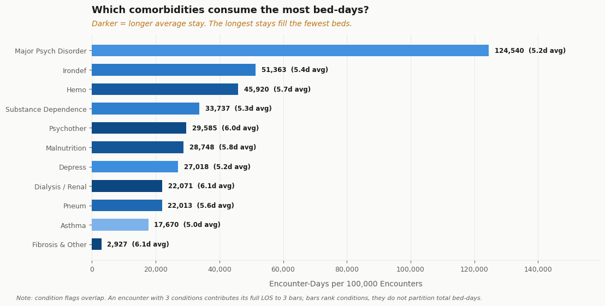
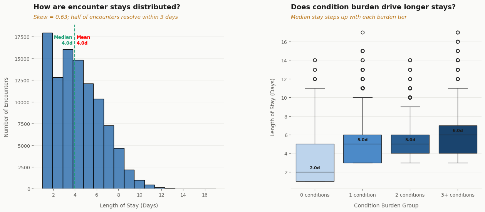
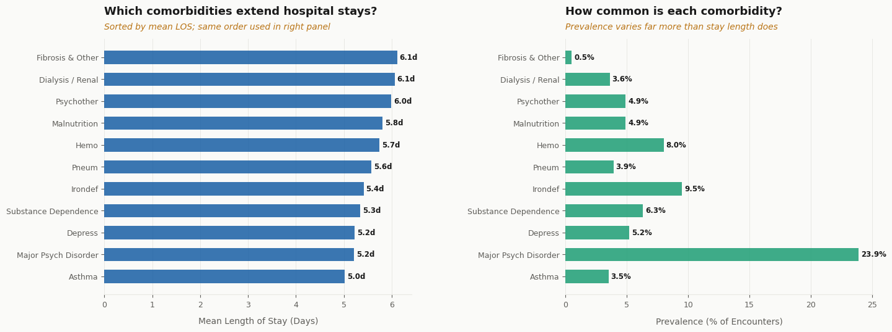
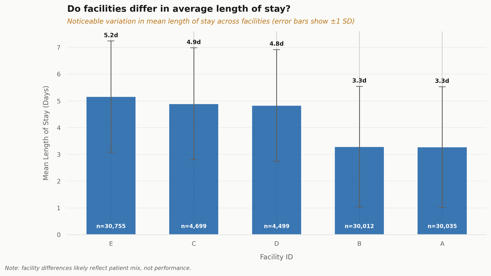

# Which Conditions Fill the Most Hospital Beds, and Why It Isn't the Longest Stays
Descriptive analysis of 100,000 hospital encounters using synthetic data.. This analysis demonstrates the methodology and does not represent any real hospital.

The condition with the longest average stay consumes 0.7% of bed capacity. The condition with a near-average stay consumes 31%. If you plan capacity around stay length, you plan around the wrong thing.
 
**Stack:** Python · pandas · scipy · matplotlib · seaborn

**Scope:** Descriptive only. No prediction, no modelling.

**Unit of analysis:** Encounters. The dataset has no patient identifier.

-------

## The Findings
Length of stay tells you how long one patient occupies a bed. It doesn't tell you where capacity goes. That depends on how *often* a condition appears, multiplied by how *long* those stays run.

The dataset reports both. Multiplying them inverts the picture:

| Condition | Prevalence | Mean LOS | Encounter-days | Share |
|-----------|-----------:|---------:|---------------:|------:|
| Major Psych Disorder | 23.9% | 5.21 d | 124,540 | 30.7% |
| Irondef | 9.5% | 5.41 d | 51,363 | 12.7% |
| Hemo | 8.0% | 5.74 d | 45,920 | 11.3% |
| Substance Dependence | 6.3% | 5.35 d | 33,737 | 8.3% |
| Psychother | 4.9% | 5.99 d | 29,585 | 7.3% |
| Malnutrition | 4.9% | 5.81 d | 28,748 | 7.1% |
| Depress | 5.2% | 5.23 d | 27,018 | 6.7% |
| Dialysis / Renal | 3.6% | 6.06 d | 22,071 | 5.4% |
| Pneum | 3.9% | 5.58 d | 22,013 | 5.4% |
| Asthma | 3.5% | 5.01 d | 17,670 | 4.4% |
| Fibrosis & Other | 0.5% | 6.11 d | 2,927 | 0.7% |

<br>



<br>

Fibrosis has the longest stays in the dataset (6.11 days) and accounts for 2,927 encounter-days. Major Psych Disorder has stays 15% shorter and accounts for 124,540, roughly **42× more**. Rank conditions by stay length and Fibrosis comes first. Rank them by beds consumed and it comes last.

**So what:** for capacity planning, prevalence dominates severity. The conditions worth attention are the common ones with unremarkable stays, not the rare ones with long ones.

**The caveat:** condition flags overlap. An encounter carrying three comorbidities contributes its full length of stay to three rows. These figures *rank* conditions by bed-day contribution, they do not *partition* total bed-days. The flagged sum (405,592) and the dataset's actual patient-days (400,103) land close by coincidence, 57.3% of encounters carry zero flags and contribute nothing, roughly offsetting the double-counting. The two numbers are not comparable and should not be read as if they were.

-------
 
## Supporting Findings
 
**Condition burden predicts length of stay (the boring result).**
Encounters with 3+ comorbidities average 5.93 days against 3.84 for the rest: a 2.09-day gap, Cohen's d = 0.911 (large). True, and unsurprising, sicker patients stay longer. It's context for the bed-days finding, not a finding in itself.

<br>



<br>

**Length of stay is right-skewed but tightly clustered.**
Mean and median both 4.0 days, SD 2.36, range 1–17. Skewness = 0.63. Nearly half of encounters (46.9%) resolve within 3 days; 8.6% exceed a week. 95% CI [3.986, 4.016], narrow, because n = 100,000 makes precision cheap and effect size the only interesting question.

**Single conditions matter less than co-occurrence.**
Mean LOS spans just 1.1 days across all 11 conditions, 5.01 (Asthma) to 6.11 (Fibrosis). But encounters carrying 3+ conditions run 2.09 days longer than those carrying fewer. How many conditions an encounter has moves LOS nearly twice as much as which one it is.

<br>



<br>

**Facility variation exists and is not interpretable here.**
Mean LOS runs 3.27 days (Facilities A, B) to 5.16 (Facility E), a 58% spread. The dataset carries no acuity or case-mix adjustment, so this cannot be separated from patient mix. It is reported, but unexplained.

<br>


 
-------
 
## Deliberate Scope Decisions
 
These are exclusions with explicit reasons:
 
- **No complexity or risk score.** Weighting comorbidities into a composite requires clinical weights this dataset can't justify. `num_conditions` is used instead as an unweighted count.
- **No cost estimate.** No charge or payer data exists. Any cost figure would be length of stay multiplied by an invented rate.
- **No readmission rate.** No patient identifier links encounters to individuals. Microsoft defines `rcount` as readmissions within 180 days during data generation, but the linkage isn't released, so the rate can't be independently computed. `prior_visit_flag` (rcount > 0, 45.0% of encounters) is a proxy and is labelled as one throughout.
- **No outlier removal.** Stays of 10–17 days are clinically plausible. Date arithmetic confirmed every value is internally consistent with its admission and discharge dates.
- **No prediction or modelling.** This dataset is widely used for regression tutorials. Descriptive scope is a deliberate choice, the analytical questions here are answerable without a model, and adding one would obscure rather than sharpen them.
- **No deduplication of overlapping condition flags.** Assigning shared bed-days across co-occurring conditions requires an attribution rule this data can't support. Overlap is disclosed instead of resolved.
 
-------
 
## Data

**Source:** [Microsoft Hospital Length of Stay dataset](https://microsoft.github.io/r-server-hospital-length-of-stay/input_data.html), via [Kaggle](https://www.kaggle.com/datasets/aayushchou/hospital-length-of-stay-dataset-microsoft)
**Size:** 100,000 encounters, 28 columns, 2012
**Nature:** Synthetic. Generated for tutorial use. Findings describe the dataset's internal structure and demonstrate method. They do not describe real clinical populations and no result here should be read as a claim about actual hospital operations.

**Validation performed before analysis:**
- Zero nulls, zero duplicate encounter IDs, zero fully duplicated rows
- Length of stay recalculated from admission and discharge dates and cross-checked against the provided column, 100,000/100,000 match
- Range check: 1–17 days, no zero or negative values

**Derived columns (3):**

| Column | Type | Definition |
|---|---|---|
| `prior_visit_flag` | Analytical | 1 if `rcount` > 0. A proxy for visit history, not a readmission metric. |
| `num_conditions` | Analytical | Sum of 11 binary comorbidity flags. |
| `burden_group` | Display | `num_conditions` binned to 0 / 1 / 2 / 3+ for chart ordering. |

Rcount is defined as readmissions within 180 days per Microsoft. It is used here as an indicator only. The data is synthetic,  it is not a verified clinical metric. Values of '5+' are encoded as 5. rcount = 5 (represents '5 or more prior admissions', not exactly 5).

A fourth column, `los_calculated`, exists only on a validation copy of the frame. It confirmed the date arithmetic and was discarded rather than carried into the analysis.
  
-------
 
## Statistical Methods
 
| Method            | Applied to              | Note                                                   |
|-------------------|-------------------------|--------------------------------------------------------|
| 95% CI (z = 1.96) | Mean LOS                | n = 100,000 justifies the normal approximation         |
| Welch's t-test    | High vs low burden      | Unequal variances not assumed                          |
| Cohen's d         | Effect size             | n-weighted pooled SD. Reported ahead of the p-value.   |
| Pearson r         | `num_conditions` vs LOS | r = 0.417                                              |
| Spearman ρ        | Same, rank-based        | ρ = 0.469 close to Pearson, so the linear read holds |
 
At n = 100,000 the p-value is a formality. All results lead with effect size.
 
-------
 
## Charts
 
| # | Title                                           | Type                     |
|---|-------------------------------------------------|--------------------------|
| 1 | How are hospital encounter stays distributed?   | Histogram + box plot 
| 2 | Do facilities differ in average length of stay? | Bar + std dev error bars 
| 3 | Comorbidity prevalence and mean LOS             | Two-panel bar 
| 4 | Condition burden: LOS and prior visit rate      | Combo bar 

-------
 
## How to Run
 
1. Install the required packages:

   ```bash
   pip install -r requirements.txt
   ```

2. Download the dataset from Kaggle and save it as `data/Length_of_Stay_Database.csv`.

3. Open `notebooks/hospital_los_analysis.ipynb`.

4. Run all cells. The notebook saves charts and CSV outputs to the `outputs/` directory.

5. If using Google Colab:
   - Update the file path in **Section 1**.
   - Uncomment `drive.mount()`.
 
-------
 
## Limitations
 
- **Synthetic data from 2012.** Generated for tutorials. Not generalisable to real populations, and the generating assumptions predate a decade of change in care patterns.
- **Encounter-level only.** No patient identifier exists, so the same individual may appear multiple times with no way to detect it. Patient-level analysis is impossible on this data.
- **`prior_visit_flag` is a proxy.** It indicates prior visits; it is not a verified readmission flag.
- **Condition flags overlap.** Encounter-day figures rank conditions; they do not partition capacity.
- **Facility variation is unadjusted.** Case mix is the likely driver and cannot be ruled out. No performance claim is made or supported.
- **Correlational throughout.** No causal claim is made anywhere in this analysis.
 
-------
 
## Dataset Citation
 
Microsoft. *Hospital Length of Stay Dataset.*

[https://microsoft.github.io/r-server-hospital-length-of-stay/input_data.html](https://www.kaggle.com/datasets/aayushchou/hospital-length-of-stay-dataset-microsoft?resource=download)
Available via Kaggle.
 
