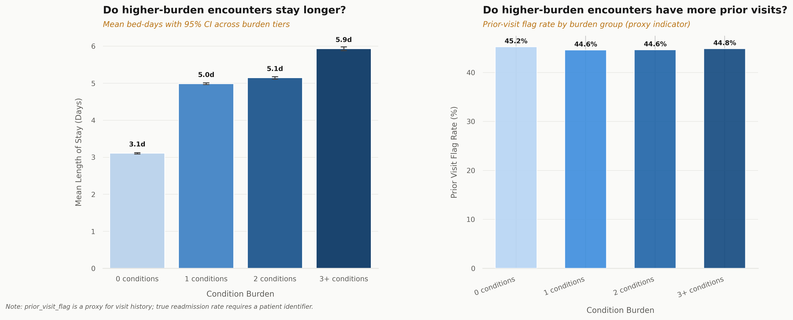

# EDA and Descriptive Analysis: Hospital Length of Stay
Analysis of 100,000 hospital encounter records. Python, pandas, scipy, etc. Exploratory workflow, data validation, and statistical framing.
 
**Dataset:** Microsoft Hospital LOS (Kaggle), 100,000 synthetic encounter records, 28 columns, 2012.
 
**Source:** https://microsoft.github.io/r-server-hospital-length-of-stay/input_data.html
 
**Tools:** Python (pandas, matplotlib, seaborn, scipy)
 
**Type:** Descriptive analytics only. No ml/prediction.
 
**Unit of analysis:** Encounters. No patient identifier exists in this dataset.

-------

## Business Questions
1. How is length of stay distributed across encounters?
2. Which clinical conditions are associated with longer stays?
3. Is there facility level variation in length of stay?

-------
 
## Key Findings
 
**Length of Stay**
- Mean and median both 4.0 days. Std dev 2.4 days.
- Distribution is right-skewed: 46.9% of encounters resolved within 3 days, 8.6% exceed 7 days.
- Range: 1 to 17 days. No outliers removed as long stays are clinically valid encounters validated through date arithmetic cross check.

 
**Condition Burden**
- 57.3% of encounters have zero flagged comorbidities.
- Encounters with 3+ conditions average 5.93 days vs 3.84 days for those with fewer than 3 (difference of 2.09 days).
- Cohen's d = 0.919 (large effect). Pearson r = 0.417.
- Most prevalent comorbidity: psychologicaldisordermajor (23.9% of encounters).

 
**Facility Variation**
- Mean LOS ranges from 3.27 days (Facilities A and B) to 5.16 days (Facility E), a 58% difference. Facilities C and D are 4.89 and 4.83 days respectively.
- Variation reflect patient mix. No case mix adjustment applied. Not described as a performance gap.

 
-------
 
## Deliberate Scope Decisions
 
These are exclusions with explicit reasons:
 
- **No complexity/risk score:** any weighting would be arbitrary and indefensible. num_conditions is used instead.
- **No cost estimate:** the dataset has no charge or payer data. Any figure would be LOS multiplied by a made-up rate.
- **No readmission rate caculated:** no patient identifier exists to link encounters to the same individual. Microsoft's definition of recount is readmissions within 180 days during data generation but no linkage is provided. Therefore, it can not be independently verified or calculated.
- **No ML/prediction:** this dataset is commonly used for regression tutorials. The descriptive version rather demonstrates solid exploratory workflow before modelling.
- **No outlier removal:** stays of 10-17 days are clinically plausible. Date arithmetic confirmed all values are internally consistent.
 
-------
 
## rcount Definition
 
rcount is defined as readmissions within 180 days per Microsoft. It is used here as an indicator only. The data is synthetic,  it is not a verified clinical metric.
 
Values of '5+' are encoded as 5. rcount = 5
represents '5 or more prior admissions', not exactly 5.
 
-------
 
## Derived Columns
 
3 analytical + 1 display helper = 4 total.
 
| Column           | Type           | Description                                 |
|------------------|----------------|---------------------------------------------|
| admission_month  | Analytical     | Month extracted from vdate 
| prior_visit_flag | Analytical     | 1 if rcount > 0, else 0 
| num_conditions   | Analytical     | Sum of 11 binary comorbidity flags 
| burden_group     | Display helper | pd.cut() bands of num_conditions for charts 
 
Note: los_calculated was created on a validation copy (df_check) only. It confirmed lengthofstay matches date arithmetic and was discarded (it is not a project column).
 
-------
 
## Statistical Methods
 
| Method         | Used For                                 |
|----------------|------------------------------------------|
| Welch's t-test | High vs low burden LOS comparison 
| Cohen's d      | Effect size, always led over p-value 
| Pearson r      | Linear correlation, num_conditions vs LOS 
| Spearman rho   | Rank-based confirmation on skewed data 
 
At n = 100,000 the p-value is a formality. All results lead
with effect size.
 
-------
 
## Charts
 
| # | Title                                           | Type                     |
|---|-------------------------------------------------|--------------------------|
| 1 | How are hospital encounter stays distributed?   | Histogram + box plot 
| 2 | Do facilities differ in average length of stay? | Bar + std dev error bars 
| 3 | Comorbidity prevalence and mean LOS             | Two-panel bar 
| 4 | Condition burden: LOS and prior visit rate      | Combo bar 

-------
 
## How to Run
 
1. Download the dataset from Kaggle: https://www.kaggle.com/datasets/[dataset-url]
   Save it as: data/Length_of_Stay_Database.csv
 
2. Install dependencies:
   pip install -r requirements.txt
 
3. Open and run the notebook:
   notebooks/hospital_los_analysis.ipynb
 
   Note: If running on Google Colab, update the file path in
   Section 1 to point to your Drive location and uncomment the
   drive.mount() line.
 
-------
 
## Outputs
 
Pre-run outputs are in /outputs so you can review result without running the notebook:
 
| File                    | Contents                                               |
|-------------------------|--------------------------------------------------------|
| summary_stats.csv       | Top-level metrics: mean LOS, std dev, CI, burden rates |
| condition_analysis.csv  | Per-comorbidity mean LOS and prevalence                |
| facility_comparison.csv | Per-facility encounter count, mean LOS, std dev        |
 
-------
 
## Limitations
 
- Encounter level only. Same individual may appear multiple times.
- No patient identifier (patient-level analysis is not possible).
- Synthetic data (2012) (not generalisable to real populations).
- prior_visit_flag is an indicator, not a verified readmission flag.
- Facility variation may reflect patient mix, not performance.
 
-------
 
## Dataset Citation
 
Microsoft. Hospital Length of Stay Dataset.
https://microsoft.github.io/r-server-hospital-length-of-stay/input_data.html
Available via Kaggle.
 
